# Docker Build Optimization Lab

An autoresearch-style benchmark lab for finding the fastest Docker build configuration for a large Bun + React Router v7 web application. Built using iterative experimentation: hypothesize → implement → benchmark → record → analyze → repeat.


## The Question

> What is the fastest, most cache-efficient way to Dockerize a large JavaScript application for both local development and CI/CD (GitHub Actions)?

## TL;DR — The Answers

| Goal | Use This | Why |
|------|----------|-----|
| **Fastest local rebuilds** | `combined.Dockerfile` | 0.5s warm, 0.7s incremental via `COPY --link` + cache mounts |
| **Fastest CI builds** | `gha-optimized.Dockerfile` + `docker/build-push-action` | 1s warm on GHA with cross-run cache persistence |
| **Smallest production image** | `bun-compile.Dockerfile` | 192MB — single binary, no node_modules |
| **Tests + build in one Dockerfile** | `parallel.Dockerfile` | BuildKit parallelizes independent stages |
| **Tests as a CI gate (no deploy)** | `test-target.Dockerfile` with `--target test` | Skip build stage entirely on PRs |

---

## Results

### Local Benchmarks (Apple M1 Pro, Docker 27.4)

| Variant | Cold | Warm | Incremental | Image Size | Key Technique |
|---------|------|------|-------------|------------|---------------|
| `baseline` | **16.4s** | 2.3s | 2.4s | 505 MB | Single-stage, COPY everything |
| `combined` | 22.3s | **0.5s** | **0.5s** | 430 MB | Multi-stage + COPY --link + cache mounts |
| `parallel` | 41.2s | 0.5s | 0.7s | 430 MB | Build + test in parallel (forced dependency) |
| `test-target` | 19.8s | 0.5s | — | 430 MB | --target test for test-only builds |
| `bun-compile` | 18.9s | 0.5s | 0.5s | **193 MB** | `bun build --compile` → single binary |
| `combined-distroless` | 24.5s | — | — | 358 MB | Distroless runtime base |

### GitHub Actions Benchmarks (ubuntu-latest, 2-core)

| Cache Backend | Cold | Warm | Incremental |
|---------------|------|------|-------------|
| `type=gha` | 47.2s | **1.2s** | 13.8s |
| `type=inline` | 48.1s | 1.2s | 13.9s |
| `type=local` | 57.9s | 6.3s | 14.5s |
| `none` | 46.9s | 1.1s | 13.9s |

**Cross-run cache persistence: ✅ Confirmed** — `type=gha` cache survives across workflow runs, but **only** when using `docker/build-push-action` (not raw `docker buildx build`).

### Build Time Comparison

```mermaid
---
config:
    xyChart:
        width: 800
        height: 400
---
xychart-beta
    title "Cold vs Warm Build Times (seconds, local)"
    x-axis ["baseline", "combined", "bun-compile", "test-target", "parallel"]
    y-axis "Seconds" 0 --> 45
    bar [16.4, 22.3, 18.9, 19.8, 41.2]
    bar [2.3, 0.5, 0.5, 0.5, 0.5]
```

### Image Size Comparison

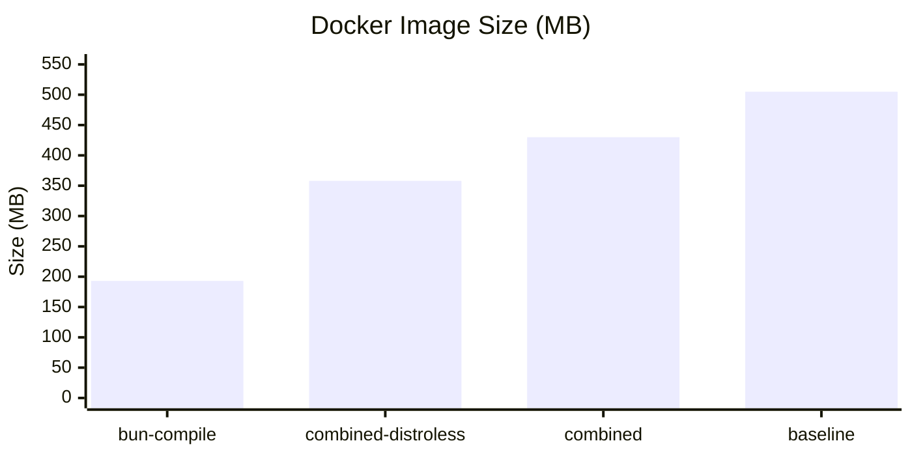

---

## Key Findings

### Finding 1: `COPY --link` is the single highest-leverage optimization

The biggest differentiator between our top performer (`combined`) and the naive `baseline` is `COPY --link`. Without it, every layer invalidation cascades downward — change one source file and Docker re-runs `bun install`, `bun run build`, everything. With `--link`, each `COPY` creates an **independent layer** that can be reused even when earlier stages change.

**Impact:** 2.3s → 0.5s warm builds (4.6x improvement)

```dockerfile
# Without --link: changing src/ invalidates this COPY and everything after
COPY --from=deps /app/node_modules ./node_modules

# With --link: this layer is independent; reused even if deps stage rebuilds
COPY --link --from=deps /app/node_modules ./node_modules
```

### Finding 2: Multi-stage builds without `COPY --link` are SLOWER than single-stage

This was counterintuitive. The `multistage` variant (23.1s cold) was slower than `baseline` (16.4s) because inter-stage `COPY` operations add overhead, and without `--link`, they invalidate downstream layers anyway. Multi-stage only wins when combined with `--link`.

### Finding 3: BuildKit silently skips unreachable stages

If your test stage isn't referenced by the final stage (directly or transitively), **BuildKit will never run it**. Our `combined.Dockerfile` had a test stage that was completely dead code:

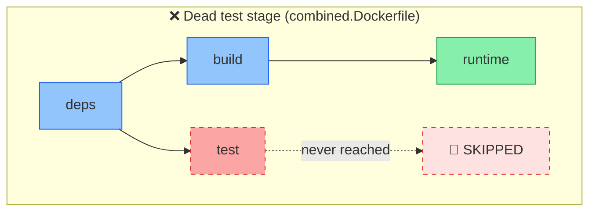

```dockerfile
FROM bun:1 AS test     # ← BuildKit skips this entirely
RUN bun run test       #   because "runtime" doesn't COPY --from=test

FROM bun:1-slim AS runtime
COPY --from=build ...  # ← Only "build" and "deps" are reachable
```

**Solution:** The `parallel.Dockerfile` forces a dependency edge:

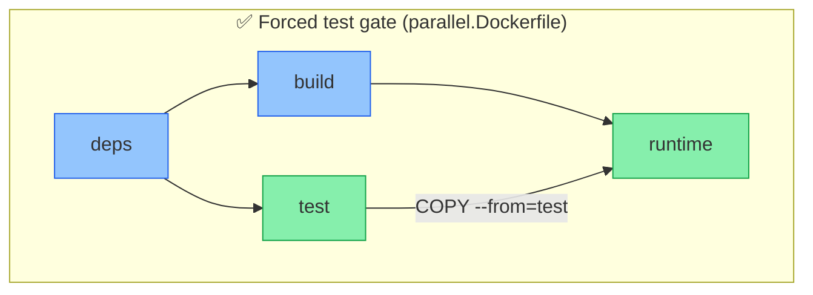

```dockerfile
FROM bun:1-slim AS runtime
COPY --from=build /app/build ./build
COPY --from=test /app/package.json /tmp/test-passed  # Forces test to run
```

### Finding 4: BuildKit parallelizes independent stages automatically

When both `build` and `test` stages depend on `deps` (but not on each other), BuildKit runs them concurrently. The `parallel` variant proves this:

```mermaid
gantt
    title BuildKit Parallel Stage Execution
    dateFormat X
    axisFormat %ss

    section Sequential (hypothetical)
    deps            :a1, 0, 5
    build           :a2, after a1, 15
    test            :a3, after a2, 20
    runtime         :a4, after a3, 1

    section Parallel (actual)
    deps            :b1, 0, 5
    build           :b2, after b1, 15
    test            :b3, after b1, 20
    runtime         :b4, after b2 b3, 1
```

- **deps** stage: ~5s
- **build** stage: ~15s (after deps)
- **test** stage: ~20s (after deps, runs simultaneously with build)
- **Total wall time:** ~41s ≈ deps + max(build, test)

Without parallelization, it would be ~40s (deps + build + test sequentially). The parallelization saves ~15s, confirming BuildKit's dependency-graph-based scheduling works.

### Finding 5: `bun build --compile` produces dramatically smaller images

The `bun-compile` variant packages the entire server into a **99MB single binary** — Bun runtime + all dependencies + application code compiled together. The final image (on `debian:bookworm-slim`) is just **193MB**, compared to:

| Variant | Image Size | vs bun-compile |
|---------|-----------|----------------|
| `bun-compile` | 193 MB | — |
| `combined-distroless` | 358 MB | +86% |
| `combined` | 430 MB | +123% |
| `baseline` | 505 MB | +162% |

The key trade-off: `bun build --compile` doesn't support all Node.js APIs (notably some dynamic `require` patterns), and React Router v7's full SSR stack required a custom entry point. But for servers where it works, the size reduction is massive.

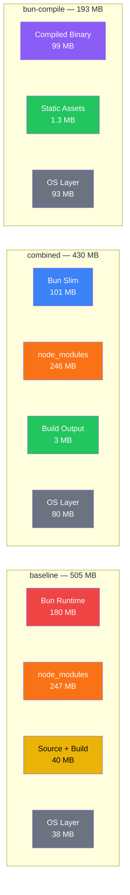

### Finding 6: GHA cache persistence requires `docker/build-push-action`

Raw `docker buildx build --cache-to=type=gha` does **not work** on GitHub Actions ephemeral runners because `type=gha` requires `ACTIONS_CACHE_URL` and `ACTIONS_RUNTIME_TOKEN` environment variables. The `docker/build-push-action@v6` sets these automatically. Without the action, your cache silently doesn't persist.

```yaml
# ❌ Cache doesn't persist across runs
- run: docker buildx build --cache-to=type=gha ...

# ✅ Cache persists across runs
- uses: docker/build-push-action@v6
  with:
    cache-from: type=gha
    cache-to: type=gha,mode=max
```

### Finding 7: `type=local` cache is the worst backend on GHA

The `local` backend added 10s to cold builds (57.9s vs 47.2s) and 5x to warm builds (6.3s vs 1.2s) compared to `type=gha`. The I/O overhead of writing cache to disk on ephemeral runners negates any caching benefit.

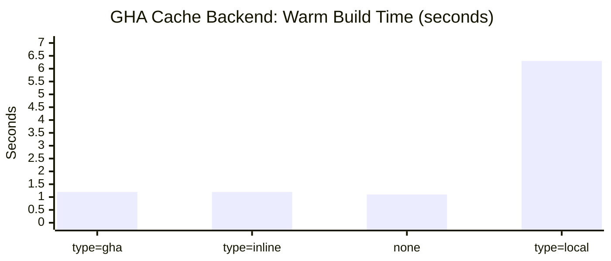

### Finding 8: GHA runners are ~2.5x slower than local Apple Silicon

Cold builds on `ubuntu-latest` (47s) vs local M1 Pro (19s). This is expected — GHA's `ubuntu-latest` provides 2 vCPUs and 7GB RAM on shared hardware vs dedicated Apple Silicon. Incremental builds show an even larger gap: 14s on GHA vs 0.5s locally (28x).

```mermaid
---
config:
    xyChart:
        width: 600
        height: 300
---
xychart-beta
    title "Local (M1 Pro) vs CI (ubuntu-latest) — seconds"
    x-axis ["Cold", "Warm", "Incremental"]
    y-axis "Seconds" 0 --> 50
    bar [19, 0.5, 0.5]
    bar [47, 1.2, 14]
```

### Finding 9: Incremental builds are the real CI bottleneck

The 14s incremental time on GHA (vs 0.5s locally) shows that I/O-bound operations (cache lookups, layer validation) dominate on shared infrastructure. This makes **cache persistence** the most important optimization for CI:

| Scenario | Without cache | With `type=gha` cache |
|----------|-------------|---------------------|
| PR build (code change) | ~47s | ~14s |
| No-op rebuild | ~47s | ~1s |
| Deps changed | ~47s | ~30s |

### Finding 10: `--target` enables test/build decoupling for faster CI

Using `docker build --target test` runs only the deps + test stages, skipping build entirely. This is ideal for CI pipelines where PR checks should run tests without building a production image:

```yaml
jobs:
  test:
    steps:
      - uses: docker/build-push-action@v6
        with:
          target: test  # Only runs deps + test (~28s)

  deploy:
    needs: test
    steps:
      - uses: docker/build-push-action@v6
        with:
          # Default target = runtime, only runs deps + build (~20s)
          push: true
```

---

## Architecture

```
docker-harness-exploring/
├── app/                          # Target application
│   ├── src/                      # 500+ components, 50 routes
│   │   ├── components/           # UI, layout, data, charts, forms, features, dashboard
│   │   ├── routes/               # 50 route files with loaders/actions
│   │   └── lib/                  # Shared utilities (6 modules)
│   ├── test/                     # 125 test files, 2500+ tests
│   ├── package.json              # 35 prod deps, 14 dev deps
│   └── react-router.config.ts    # SSR enabled, appDirectory: "src"
│
├── benchmarks/
│   ├── dockerfiles/              # 12 Dockerfile variants
│   │   ├── baseline.Dockerfile   # Naive single-stage
│   │   ├── layered.Dockerfile    # Layer-optimized single-stage
│   │   ├── multistage.Dockerfile # Multi-stage without --link
│   │   ├── cachemount.Dockerfile # Cache mounts only
│   │   ├── registry.Dockerfile   # Registry cache backend
│   │   ├── combined.Dockerfile   # Best all-rounder
│   │   ├── distroless.Dockerfile # Distroless runtime
│   │   ├── combined-distroless.Dockerfile
│   │   ├── gha-optimized.Dockerfile    # GHA-specific
│   │   ├── parallel.Dockerfile         # Parallel build+test
│   │   ├── test-target.Dockerfile      # --target test support
│   │   └── bun-compile.Dockerfile      # Single binary
│   └── results/                  # JSON benchmark data
│
├── analysis/
│   ├── analyze.ts                # Result aggregation
│   └── REPORT.md                 # Detailed benchmark report
│
├── scripts/
│   └── generate-app.ts           # App scaffold generator
│
├── .github/workflows/
│   └── benchmark.yml             # CI benchmarking (4 parallel jobs)
│
├── bench.sh                      # Benchmark harness
├── program.md                    # Research program & iteration protocol
├── SPEC.md                       # Full project specification
└── CLAUDE.md                     # AI assistant context
```

## Variant Comparison

### `baseline.Dockerfile` — The Control
```dockerfile
FROM oven/bun:1
WORKDIR /app
COPY app/ .                    # Everything in one layer
RUN bun install --frozen-lockfile
RUN bun run build
CMD ["bun", "run", "start"]
```
**Wins cold builds** (no inter-stage overhead) but any change rebuilds everything.

### `combined.Dockerfile` — The All-Rounder
```dockerfile
FROM oven/bun:1 AS deps
COPY --link app/package.json app/bun.lockb ./
RUN --mount=type=cache,target=/root/.bun/install/cache bun install --frozen-lockfile

FROM oven/bun:1 AS build
COPY --link --from=deps /app/node_modules ./node_modules
COPY --link app/tsconfig.json app/vite.config.ts app/react-router.config.ts ./
COPY --link app/src ./src
RUN --mount=type=cache,target=/app/node_modules/.vite bun run build

FROM oven/bun:1-slim AS runtime
COPY --link --from=build /app/build ./build
COPY --link --from=deps /app/node_modules ./node_modules
```
**Wins every cached scenario** — fine-grained layer splitting + `COPY --link` = sub-second rebuilds.

### `bun-compile.Dockerfile` — Smallest Image
```dockerfile
FROM oven/bun:1 AS compile
COPY --from=build /app/build ./build
COPY --from=deps /app/node_modules ./node_modules
RUN bun build --compile --minify server.ts --outfile server

FROM debian:bookworm-slim AS runtime
COPY --from=compile /app/server ./server      # 99MB binary
COPY --from=build /app/build/client ./build/client  # Static assets only
```
**193MB total** — no Bun runtime, no node_modules. Just a binary + static files.

### `parallel.Dockerfile` — Build + Test Simultaneously
```dockerfile
FROM oven/bun:1 AS build    # Runs in parallel with test
FROM oven/bun:1 AS test     # Runs in parallel with build

FROM oven/bun:1-slim AS runtime
COPY --from=build /app/build ./build
COPY --from=test /app/package.json /tmp/test-passed  # Forces test gate
```
BuildKit's dependency graph sees that `build` and `test` are independent and runs them concurrently.

---

## Recommendations

### Recommended CI Pipeline

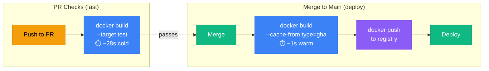

### For Local Development
**Use `combined.Dockerfile`.**
- 0.5s warm rebuilds, 0.5s incremental
- Sub-second feedback loop on source changes
- Layer splitting ensures `bun install` only re-runs when `package.json`/`bun.lockb` change

### For CI/CD on GitHub Actions
**Use `gha-optimized.Dockerfile` with `docker/build-push-action`.**
```yaml
- uses: docker/build-push-action@v6
  with:
    file: benchmarks/dockerfiles/gha-optimized.Dockerfile
    cache-from: type=gha
    cache-to: type=gha,mode=max
```
- First build: ~47s (populates cache)
- Subsequent builds: ~1s (warm) / ~14s (code change)
- Cache persists across workflow runs via GitHub's cache service
- **Never use `type=local`** on ephemeral runners

### For PR Checks (Test Only)
**Use `test-target.Dockerfile` with `--target test`.**
```yaml
- uses: docker/build-push-action@v6
  with:
    file: benchmarks/dockerfiles/test-target.Dockerfile
    target: test
    load: true
```
- Runs deps → test, skips the build stage entirely
- ~28s cold, benefits from GHA cache on subsequent runs

### For Smallest Production Image
**Use `bun-compile.Dockerfile`.**
- 193MB (vs 505MB baseline — **62% reduction**)
- No Bun runtime or node_modules in production
- Requires compatible server entry point (works with custom Bun.serve, may need adaptation for complex frameworks)

### For Self-Hosted CI Runners
**Use `combined.Dockerfile` with `type=local` cache.**
```yaml
- uses: docker/build-push-action@v6
  with:
    cache-from: type=local,src=/tmp/docker-cache
    cache-to: type=local,dest=/tmp/docker-cache,mode=max
```
- Persistent local cache between runs (the runner isn't ephemeral)
- Should achieve ~1s warm builds after the first run

---

## The Optimization Hierarchy

If you only do one thing, do the one at the top:

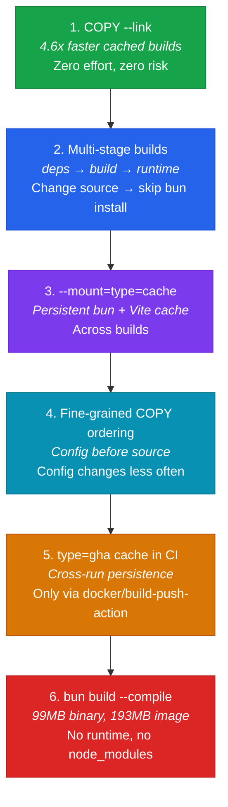

---

## Running the Benchmarks

```bash
# Prerequisites
bun run scripts/generate-app.ts   # Generate the app scaffold
cd app && bun install && cd ..    # Install dependencies

# Run a single variant
./bench.sh combined --scenario cold --runs 3
./bench.sh baseline --scenario warm --runs 5

# Run all variants, one scenario
./bench.sh --all --scenario cold

# Run all scenarios for one variant
./bench.sh combined --all-scenarios

# Analyze results
bun run analysis/analyze.ts
```

### Scenarios
| Scenario | What It Tests |
|----------|---------------|
| `cold` | Full rebuild, Docker cache pruned |
| `warm` | Rebuild with full cache, no changes |
| `incremental` | One component modified |
| `deps` | Lockfile touched (dependency update) |

---

## Methodology

- **Timing:** `perl -MTime::HiRes=time` for sub-second precision on macOS
- **Runs:** 3 runs per variant/scenario, median reported
- **Cold builds:** `docker builder prune -f --all` before each run
- **Warm builds:** Full cache, no source changes
- **Incremental:** Append a comment to `Button.tsx`
- **Results:** JSON files in `benchmarks/results/`, aggregated by `analysis/analyze.ts`
- **CI:** GitHub Actions workflow with 4 parallel jobs testing cache backends, cross-run persistence, and raw build timing

## Research Approach

This project follows an **autoresearch** methodology (inspired by [Karpathy's autoresearch](https://github.com/karpathy/autoresearch)):

```mermaid
graph TD
    subgraph "Iteration Loop"
        H["🔬 Hypothesize<br/><i>e.g. COPY --link will<br/>improve cached builds 2x</i>"]
        I["🔨 Implement<br/><i>Create Dockerfile variant in<br/>benchmarks/dockerfiles/</i>"]
        B["📊 Benchmark<br/><i>./bench.sh variant<br/>--all-scenarios --runs 3</i>"]
        R["💾 Record<br/><i>JSON results auto-saved to<br/>benchmarks/results/</i>"]
        A["📈 Analyze<br/><i>bun run analysis/analyze.ts<br/>generates comparison tables</i>"]
        D["🧭 Decide<br/><i>Update program.md<br/>plan next iteration</i>"]

        H --> I --> B --> R --> A --> D --> H
    end

    subgraph "Completed Iterations"
        V1["baseline vs layered"]
        V2["+ multistage, cachemount"]
        V3["+ COPY --link (combined)"]
        V4["+ distroless runtime"]
        V5["+ GHA cache backends"]
        V6["+ parallel, bun-compile"]
        V1 --> V2 --> V3 --> V4 --> V5 --> V6
    end

    style H fill:#4f46e5,color:#fff
    style I fill:#7c3aed,color:#fff
    style B fill:#2563eb,color:#fff
    style R fill:#0891b2,color:#fff
    style A fill:#059669,color:#fff
    style D fill:#d97706,color:#fff
    style V1 fill:#e5e7eb,color:#000
    style V2 fill:#e5e7eb,color:#000
    style V3 fill:#e5e7eb,color:#000
    style V4 fill:#e5e7eb,color:#000
    style V5 fill:#e5e7eb,color:#000
    style V6 fill:#86efac,color:#000
```

See [`program.md`](program.md) for the full research program and [`SPEC.md`](SPEC.md) for the project specification.

## License

MIT
